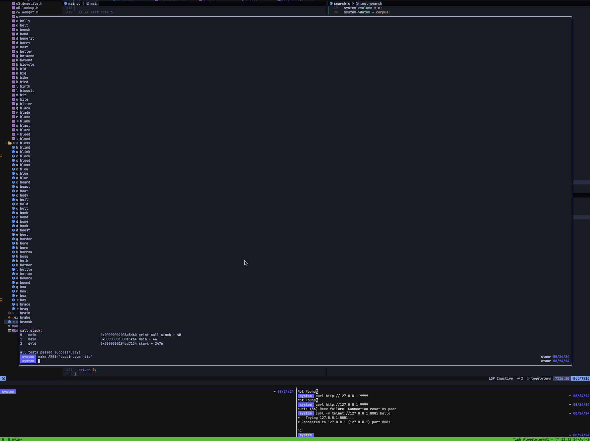

(contrary to what the name suggests, this repo is me taking
a tour of C, not giving the tour). basic ideas reimplemented in C.

#### Quickstart
1. ```make ARGS="example.com http"```
2. follow the prompt demo included below

#### Demo


#### Roadmap
- wizard for choosing which tests to run
- informative prompt messages for helping
  user provide input
- programmatic e2e for tests which involve
  servers and block program execution
- meticulous tests covering edge cases
